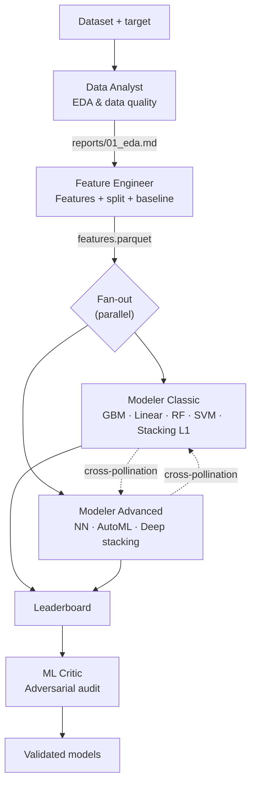
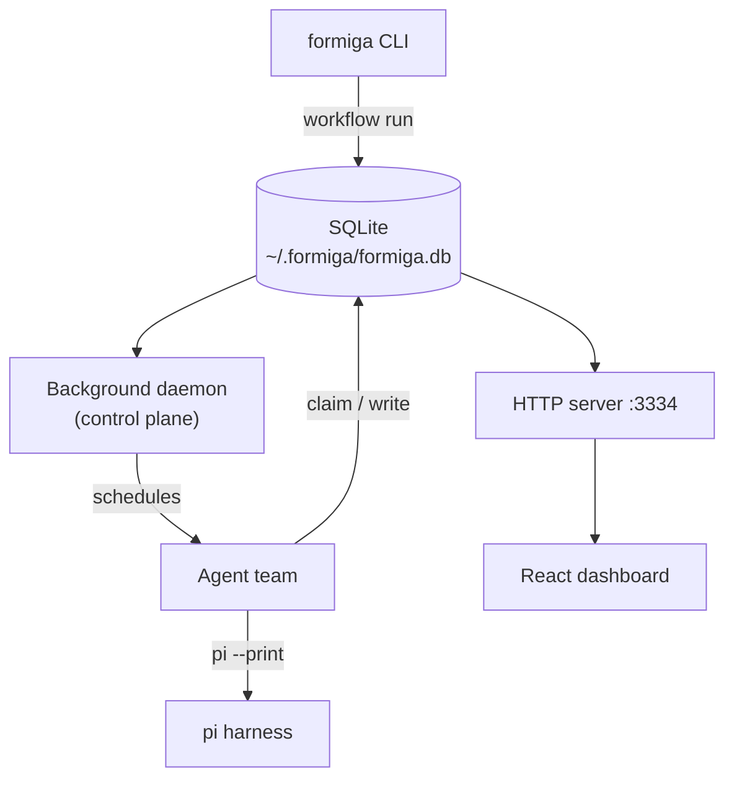

# Formiga

<p align="center"></p>

<p align="center">
  <a href="LICENSE"></a>
  = 22">
  
  
</p>

Formiga is a **Data Science and AutoResearch Multi-Agent Platform**. Point it at a dataset and walk away. The agents share artifacts through SQLite, cross-pollinate findings, and submit experiments to a live leaderboard you can watch in the browser. Every run is deterministic, resumable, and fully auditable.

<p align="center"><b>Formiga is a CLI that orchestrates a team of specialist AI agents — a Data Analyst, a Feature Engineer, two competing Modelers, and an adversarial ML Critic — through a deterministic, repeatable workflow.</b></p>

No Redis. No Kubernetes. No YAML soup. Just Node, SQLite, and a polling loop.

---

## Install

One-line install from GitHub:

```bash
curl -fsSL https://raw.githubusercontent.com/PJarbas/formiga/main/scripts/install.sh | bash
```

Or build from a local checkout:

```bash
git clone https://github.com/PJarbas/formiga.git
cd formiga
./build-and-install
```

This builds the TypeScript CLI + React dashboard and symlinks `~/.local/bin/formiga` to your checkout. Requires **Node.js 22+** and the [`pi`](https://github.com/mariozechner/pi-coding-agent) coding-agent harness.

**Or just tell your agent:**

> Clone https://github.com/PJarbas/formiga to my home dir, install it, and learn the skill bundled inside it.

## Try it in 30 seconds

```bash
# Run the ML pipeline on your CSV — Formiga auto-installs what it needs
formiga workflow run ml-pipeline \
  "dataset_path=data/train.csv target_column=price" \
  [--pi-as-harness | --hermes-as-harness]

# Open the dashboard
formiga dashboard start
open http://localhost:3334/
```

You should see the 5 agents come online, pick up the dataset, and start filling the leaderboard.

<p align="center"></p>

## How the ML pipeline works



1. **Data Analyst** explores distributions, missing values, outliers, and correlations — produces a rigorous EDA report.
2. **Feature Engineer** builds features, creates the train/val/test split, and trains a baseline every model must beat.
3. **Two Modelers compete in parallel** — Classic (gradient boosting, linear, tree-based, stacking) vs. Advanced (neural nets, AutoML, deep stacking). They share findings in real time.
4. Each experiment is registered in the **leaderboard** (SQLite).
5. **ML Critic** does an adversarial, read-only audit — flags overfitting, leakage, and inflated metrics.
6. The best validated model wins.

Every step is deterministic and resumable. Pause it, restart your laptop, resume it.

## The team

| Agent | Job | Tools |
|-------|-----|-------|
| `data-analyst` | EDA, data quality report | Read, Bash, Glob, Grep |
| `feature-engineer` | Features, split, baseline model | Read, Write, Bash, Glob, Grep |
| `modeler-classic` | Gradient boosting, linear, tree-based, stacking | Read, Write, Bash, Glob, Grep |
| `modeler-advanced` | Neural nets, AutoML, deep stacking | Read, Write, Bash, Glob, Grep |
| `ml-critic` | Adversarial audit (read-only) | Read, Bash, Glob, Grep |

Each agent has its own persona file, workspace, and acceptance criteria. The ML Critic is deliberately read-only — it audits but cannot touch models.

## Harness

Formiga needs a coding-agent harness to execute agent steps. By default it uses [`pi`](https://github.com/mariozechner/pi-coding-agent) (the default and recommended harness for production workflows).

You can choose a different harness at run time with these mutually exclusive flags:

```bash
# Default — recommended for production
formiga workflow run ml-pipeline "dataset_path=data/train.csv" --pi-as-harness

# Hermes (alpha quality, very slow, token accounting is broken)
formiga workflow run ml-pipeline "dataset_path=data/train.csv" --hermes-as-harness
```

- `--pi-as-harness` is the default and recommended choice. Use pi for production workflows.
- `--hermes-as-harness` is **Alpha quality** — very slow, and has broken token accounting.
- The two flags are **mutually exclusive** — only one can be passed at a time.
- If Hermes is selected, Formiga searches for the binary in this order:
  1. `FORMIGA_HERMES_BINARY` environment variable
  2. The `hermes` binary on your `PATH`

Harness binary validation runs at scheduling time — if the chosen harness is missing, the workflow run will fail immediately with a clear error instead of silently hanging.

## Architecture

Formiga is a **TypeScript CLI + SQLite + polling** — a lightweight, local-first Data Science and AutoResearch orchestrator. No Redis. No Kafka. No containers. Agents poll for work independently, claim steps atomically, and pass context through the database.

See [docs/architecture-overview.md](docs/architecture-overview.md) for a deep dive into the ML pipeline, template variables, sidecar JSON protocol, experiment lifecycle, and recent improvements (active failure avoidance, dataset signature transfer learning, and auto-critique / early stopping).



Everything Formiga knows lives in a single SQLite database at `~/.formiga/formiga.db`:

- `runs` — workflow executions with status, tokens, timing
- `steps` — agent steps with claim/complete/fail lifecycle
- `stories` — user stories for story-based workflows
- `experiments` — the leaderboard
- `arena_sessions` — arena competition state
- `autoresearch_sessions` — durable optimization loop state
- `dataset_signatures` — dataset fingerprint registry for cross-run warm-start
- `run_worktrees` — git worktree isolation metadata

## Dashboard

A React 19 SPA with real-time polling (TanStack Query, 3s), served by the same HTTP server on **port 3334**. The dashboard has three views: pipeline monitoring, model leaderboard, and agent detail.

| Path | Screen | What you do here |
|------|--------|------------------|
| `/` | **Command Center** | Pipeline Runs table — status badge, stage dots, metrics, and duration per round (GitLab CI-style) |
| `/pipeline` | **Pipeline Flow** | DAG view of agents with animated artifact edges, timeout progress, and side panel for logs/messages/artifacts |
| `/leaderboard` | **ML Leaderboard** | Sortable table with CSS bar charts, overfitting gap pills, fold sparklines, and arena section |

<p align="center">
  
  
</p>

### REST surface

The ML endpoints all live under `/api/`:

```bash
# Pipeline status + DAG view
curl http://localhost:3334/api/pipeline/status
curl http://localhost:3334/api/pipeline/flow

# Agents — list, detail, logs, inter-agent messages
curl http://localhost:3334/api/agents
curl http://localhost:3334/api/agents/modeler-classic
curl http://localhost:3334/api/agents/modeler-classic/logs?limit=50
curl http://localhost:3334/api/agents/modeler-classic/messages

# Leaderboard + compare + agent history
curl 'http://localhost:3334/api/leaderboard?sortBy=cvMean&sortDir=desc'
curl 'http://localhost:3334/api/leaderboard/compare?id=1&id=2'
curl 'http://localhost:3334/api/leaderboard/agent-history?agent=modeler-classic'
curl 'http://localhost:3334/api/leaderboard/current-best?runId=<id>'

# Runs — list, detail, delete
curl http://localhost:3334/api/runs
curl http://localhost:3334/api/runs/<id>
curl -X DELETE http://localhost:3334/api/runs/<id>

# Events + logs
curl http://localhost:3334/api/events
curl http://localhost:3334/api/logs-tail

# Rounds + cross-findings
curl http://localhost:3334/api/rounds
curl http://localhost:3334/api/cross-findings

# Health + stats
curl http://localhost:3334/api/health
curl http://localhost:3334/api/stats
```

Pause, resume, and cancel are also one-liners:

```bash
curl -X POST http://localhost:3334/api/pipeline/pause
curl -X POST http://localhost:3334/api/pipeline/resume
curl -X POST http://localhost:3334/api/pipeline/cancel
```

## Bundled workflows

Formiga ships with two workflows you can use today:

| Workflow | Agents | What it does |
|----------|--------|--------------|
| `ml-pipeline` | 5 | The full ML pipeline above. |
| `ml-autoresearch` | Arena agents | Durable optimization loop with competing agents and convergence detection. |

Any of them auto-installs the first time you run it:

```bash
formiga workflow run ml-pipeline "dataset_path=data/train.csv target_column=price"
formiga autoresearch "dataset_path=data/train.csv target_column=price max_rounds=5"
```

## Roll your own workflow

A workflow is a YAML file defining agents and steps. The steps share context, can run in parallel, and progress through a state machine that supports pause/resume.

```yaml
id: my-workflow
name: My Custom Workflow
agents:
  - id: researcher
    name: Researcher
    workspace:
      files:
        AGENTS.md: agents/researcher/AGENTS.md

steps:
  - id: research
    agent: researcher
    input: |
      Research {{task}} and report findings.
      Reply with STATUS: done and FINDINGS: ...
    expects: "STATUS: done"
```

Full guide: [docs/creating-workflows.md](docs/creating-workflows.md)

## AutoResearch

A **durable optimization loop** powered by the `ml-autoresearch` workflow. Arena agents compete to beat the current best model, share findings, and converge automatically.

```bash
# One command — auto-installs the workflow and starts the arena
formiga autoresearch "dataset_path=data/train.csv target_column=price max_rounds=10"
```

The arena agents:
1. Read the dataset and baseline metric
2. Fan out in parallel, each proposing a different model
3. Benchmark each model against the held-out folds
4. Keep improvements, discard regressions
5. Cross-pollinate findings between agents
6. Stop when the target metric is reached or no improvement after N rounds

Legacy subcommands (`init`, `run-experiment`, `log-experiment`, `status`, `next`, `loop`, `prune`, `wizard`) still work but emit deprecation warnings. Prefer the workflow-based invocation above.

## Command reference

**Lifecycle**

- `formiga get-ready` — install bundled workflows + start services *(optional — `workflow run` auto-installs)*
- `formiga update` — pull source, rebuild, reinstall, restart
- `formiga uninstall` — full teardown
- `formiga status` — services, paths, runs, processes

**Workflows**

- `formiga workflow run <id> <task>` — start a run *(auto-installs if needed)*
- `formiga workflow status <query>` · `workflow runs` · `workflow list`
- `formiga workflow install <id>` · `workflow uninstall <id>`
- `formiga workflow pause <run-id>` · `workflow resume <run-id>` · `workflow delete <run-id>`

**Dashboard**

- `formiga dashboard start` — start HTTP server at `http://localhost:3334`
- `formiga dashboard stop` · `dashboard status`

**Logs & debugging**

- `formiga logs [<lines>|<run-id>|#<run-number>]` — view recent events
- `formiga logs-tail [<lines>|<run-id>|#<run-number>]` — follow events live
- `formiga nudge` — wake all scheduled agents immediately

**Step operations** *(low-level, for custom harness integration)*

- `formiga step peek <agent-id>` · `step claim <agent-id>` · `step complete <step-id>` · `step fail <step-id>`
- `formiga step stories <run-id>`

**Stale run management**

- `formiga runs list-stale --min-minutes N [--json]` — list runs stale for N+ minutes
- `formiga runs cancel-stale --min-minutes N [--force]` — cancel stale runs

**AutoResearch**

- `formiga autoresearch "<task>"` — start the ml-autoresearch workflow *(recommended)*
- Legacy: `init` · `run-experiment` · `log-experiment` · `status` · `next` · `loop` · `prune` · `wizard` *(deprecated)*

Every command has `--help`.

## Requirements

- **Node.js >= 22** (uses the native `node:sqlite` module)
- **[pi](https://github.com/mariozechner/pi-coding-agent)** — the coding-agent harness Formiga drives
- **`gh` CLI** — optional, for GitHub PR integration

## Development

```bash
./build              # npm install + tsc + vite build
npm test             # unit + integration (parallel-safe, isolated HOME per test)
./run-all-e2e-tests  # fast smoke tests, no real agents
```

See [AGENTS.md](docs/AGENTS.md) for architecture, project layout, and conventions.

## License

[MIT](LICENSE)

## Origins

Formiga began as a fork of [antfarm](https://github.com/snarktank/antfarm) and pursues the same goal — orchestrating teams of AI agents through deterministic, repeatable workflows — built on top of [pi](https://github.com/mariozechner/pi-coding-agent). Credit to the original authors for the design and inspiration.
