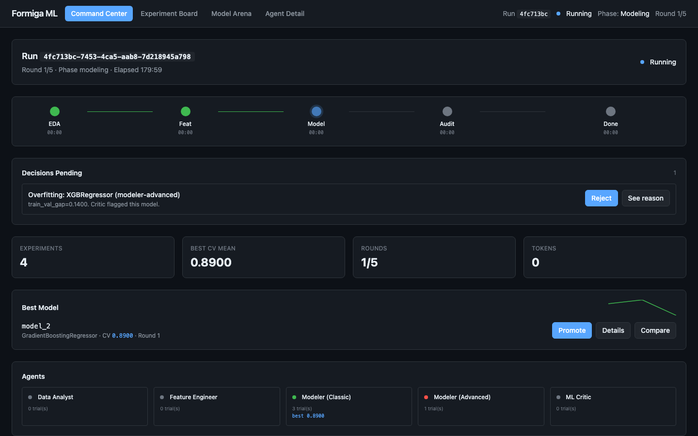
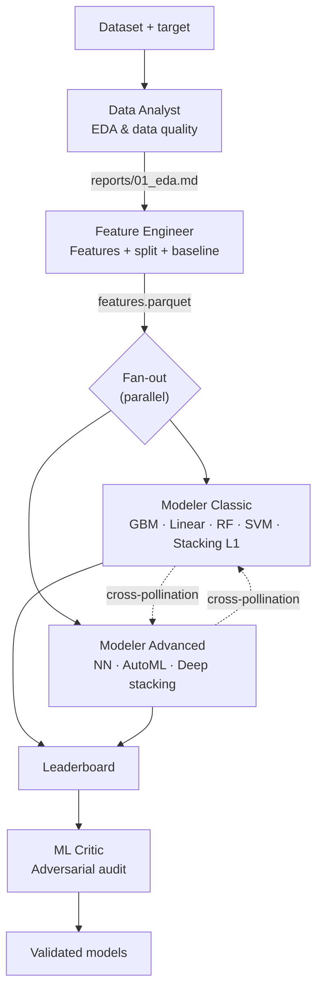
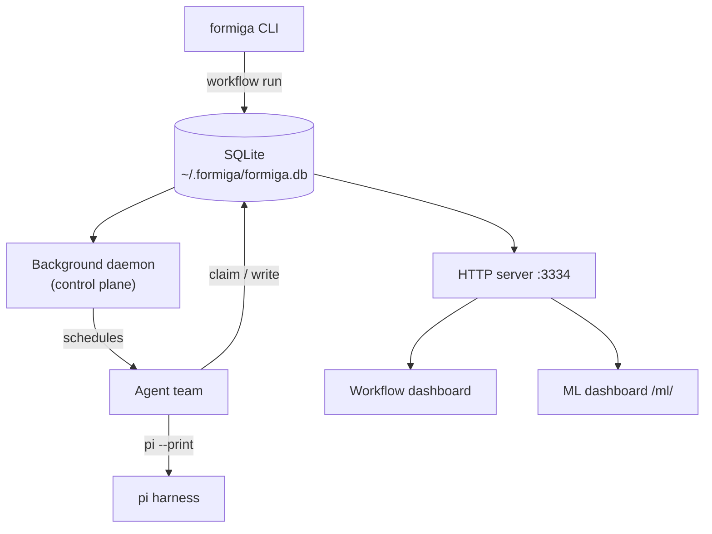
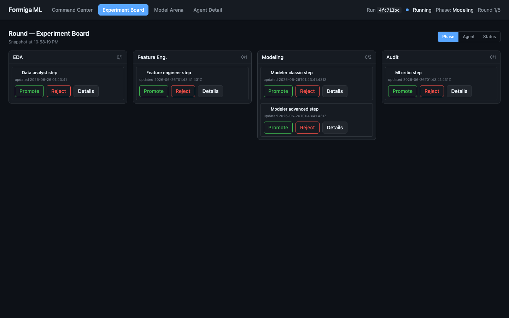
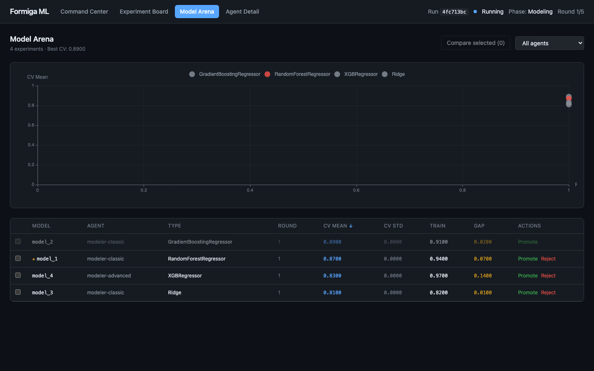
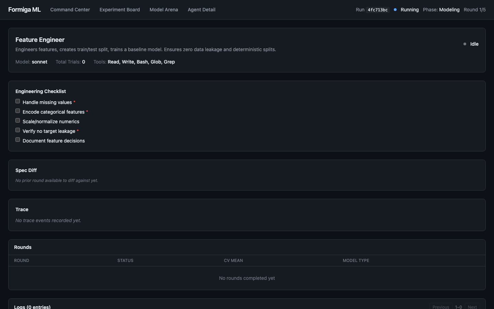

# Formiga

<p align="center"></p>

<p align="center">
  <a href="LICENSE"></a>
  = 22">
  
  
</p>

<p align="center"><b>Point Formiga at a dataset. Walk away. Come back to a leaderboard of validated models.</b></p>

Formiga is a CLI that orchestrates a team of specialist AI agents — a Data Analyst, a Feature Engineer, two competing Modelers, and an adversarial ML Critic — through a deterministic, repeatable workflow. The agents share artifacts through SQLite, cross-pollinate findings, and submit experiments to a live leaderboard you can watch in the browser.

No Redis. No Kubernetes. No YAML soup. Just Node, SQLite, and a polling loop.

---

## Install

One-line install from GitHub:

```bash
curl -fsSL https://raw.githubusercontent.com/PJarbas/formiga/main/scripts/install.sh | bash
```

Or build from a local checkout:

```bash
git clone https://github.com/PJarbas/formiga.git
cd formiga
./build-and-install
```

This builds the TypeScript CLI + React dashboard and symlinks `~/.local/bin/formiga` to your checkout. Requires **Node.js 22+** and the [`pi`](https://github.com/mariozechner/pi-coding-agent) coding-agent harness.

**Or just tell your agent:**

> Clone https://github.com/PJarbas/formiga to my home dir, install it, and learn the skill bundled inside it.

## Try it in 30 seconds

```bash
# Run the ML pipeline on your CSV — Formiga auto-installs what it needs
formiga workflow run ml-pipeline \
  "dataset_path=data/train.csv target_column=price"

# Open the dashboard
formiga dashboard start
open http://localhost:3334/ml/
```

You should see the 5 agents come online, pick up the dataset, and start filling the leaderboard.

<p align="center"></p>

## How the ML pipeline works



1. **Data Analyst** explores distributions, missing values, outliers, and correlations — produces a rigorous EDA report.
2. **Feature Engineer** builds features, creates the train/val/test split, and trains a baseline every model must beat.
3. **Two Modelers compete in parallel** — Classic (gradient boosting, linear, tree-based, stacking) vs. Advanced (neural nets, AutoML, deep stacking). They share findings in real time.
4. Each experiment is registered in the **leaderboard** (SQLite).
5. **ML Critic** does an adversarial, read-only audit — flags overfitting, leakage, and inflated metrics.
6. The best validated model wins.

Every step is deterministic and resumable. Pause it, restart your laptop, resume it.

## The team

| Agent | Job | Tools |
|-------|-----|-------|
| `data-analyst` | EDA, data quality report | Read, Bash, Glob, Grep |
| `feature-engineer` | Features, split, baseline model | Read, Write, Bash, Glob, Grep |
| `modeler-classic` | Gradient boosting, linear, tree-based, stacking | Read, Write, Bash, Glob, Grep |
| `modeler-advanced` | Neural nets, AutoML, deep stacking | Read, Write, Bash, Glob, Grep |
| `ml-critic` | Adversarial audit (read-only) | Read, Bash, Glob, Grep |

Each agent has its own persona file, workspace, and acceptance criteria. The ML Critic is deliberately read-only — it audits but cannot touch models.

## Architecture

Formiga is a **TypeScript CLI + SQLite + polling**. No Redis. No Kafka. No containers. Agents poll for work independently, claim steps atomically, and pass context through the database.



Everything Formiga knows lives in a single SQLite database at `~/.formiga/formiga.db`:

- `runs` — workflow executions with status, tokens, timing
- `steps` — agent steps with claim/complete/fail lifecycle
- `stories` — user stories for story-based workflows
- `experiments` — the leaderboard
- `autoresearch_sessions` — durable optimization loop state
- `run_worktrees` — git worktree isolation metadata

## Dashboard

A React 19 SPA with real-time polling (TanStack Query, 3s) and ECharts visualization, served by the same HTTP server on **port 3334**. The ML dashboard is organized around the four things a scientist actually does during a run — watching the pipeline, triaging experiments, comparing models, and drilling into an agent.

| Path | Screen | What you do here |
|------|--------|------------------|
| `/` | Workflow Kanban | Swim-lane view of every workflow run |
| `/ml/` | **Command Center** | Single glance: stepper, pending decisions, best model, agent strip |
| `/ml/kanban` | **Experiment Board** | Phase / Agent / Status lanes with inline Approve · Reject · Promote |
| `/ml/leaderboard` | **Model Arena** | Sortable table + scatter; select ≥2 rows to compare side-by-side |
| `/ml/agents/:name` | **Agent Detail** | Trace timeline, checklist (feature-engineer), spec diff, rounds, logs |

<p align="center">
  
  
</p>

<p align="center">
  
</p>

### REST surface

The ML endpoints all live under `/api/`:

```bash
# Single aggregated payload powering the Command Center
curl http://localhost:3334/api/command-center

# Pending decisions (spec approvals, overfitting warnings, …)
curl http://localhost:3334/api/decisions/pending

# Promote / reject experiments (orthogonal to status enum)
curl -X POST http://localhost:3334/api/experiments/<id>/promote
curl -X POST http://localhost:3334/api/experiments/<id>/reject \
  -H 'content-type: application/json' -d '{"reason":"…"}'

# Approve or reject a phase spec (UPSERT into spec_approvals)
curl -X PATCH http://localhost:3334/api/specs/<runId>:<phase>/approve
curl -X PATCH http://localhost:3334/api/specs/<runId>:<phase>/reject

# Interactive checklist per (run, phase) — UPSERT items_json
curl http://localhost:3334/api/checklist/<runId>/feat-eng
curl -X PUT http://localhost:3334/api/checklist/<runId>/feat-eng \
  -H 'content-type: application/json' -d '{"items":[…]}'

# Trace events for an agent at a given round
curl http://localhost:3334/api/trace/<agentName>/<roundNumber>

# Leaderboard + side-by-side compare
curl 'http://localhost:3334/api/leaderboard?sortBy=cvMean&sortDir=desc'
curl 'http://localhost:3334/api/leaderboard/compare?id=1&id=2'
```

Pause, resume, and cancel are also one-liners:

```bash
curl -X POST http://localhost:3334/api/pipeline/pause
curl -X POST http://localhost:3334/api/pipeline/resume
curl -X POST http://localhost:3334/api/pipeline/cancel
```

## Bundled workflows

Formiga ships with four workflows you can use today:

| Workflow | Agents | What it does |
|----------|--------|--------------|
| `do-now` | 1 | Single-shot task. No planning. |
| `just-do-it` | 1 | Describe a goal, get it done. Auto-dispatches the approach. |
| `do-review-do-verify` | 3 | Two-pass execution: do, review, revise, verify. |
| `ml-pipeline` | 5 | The full ML pipeline above. |

Any of them auto-installs the first time you run it:

```bash
formiga workflow run do-now "Fix the failing test in tests/foo.test.ts"
formiga workflow run ml-pipeline "dataset_path=data/train.csv target_column=price"
```

## Roll your own workflow

A workflow is a YAML file defining agents and steps. The steps share context, can run in parallel, and progress through a state machine that supports pause/resume.

```yaml
id: my-workflow
name: My Custom Workflow
agents:
  - id: researcher
    name: Researcher
    workspace:
      files:
        AGENTS.md: agents/researcher/AGENTS.md

steps:
  - id: research
    agent: researcher
    input: |
      Research {{task}} and report findings.
      Reply with STATUS: done and FINDINGS: ...
    expects: "STATUS: done"
```

Full guide: [docs/creating-workflows.md](docs/creating-workflows.md)

## AutoResearch

A separate, lighter mode for **durable optimization loops** — your agent runs an experiment, logs what it learned, and resumes after restarts. Project-local state, append-only history.

```bash
# Initialize a session
formiga autoresearch init \
  --goal "reduce validation loss" \
  --metric val_bpb \
  --direction lower \
  --command "uv run train.py"

# Run one experiment + log what was learned
formiga autoresearch run-experiment
formiga autoresearch log-experiment --status auto \
  --description "lower learning rate" \
  --learned "validation improved, training slowed" \
  --next-focus "test warmup schedule"

# Or run a bounded loop
formiga autoresearch loop --max-iterations 10
```

Lives entirely in your project directory:

- `autoresearch.config.json` — goal, metric, direction, benchmark command
- `autoresearch.md` — agent-facing objective and operating loop
- `autoresearch.jsonl` — append-only run history
- `autoresearch.sh` — your benchmark command

## Command reference

**Lifecycle**

- `formiga get-ready` — install bundled workflows + start services *(optional — `workflow run` auto-installs)*
- `formiga update` — pull source, rebuild, reinstall, restart
- `formiga uninstall` — full teardown
- `formiga status` — services, paths, runs, processes

**Workflows**

- `formiga workflow run <id> <task>` — start a run *(auto-installs if needed)*
- `formiga workflow status <query>` · `workflow runs` · `workflow list`
- `formiga workflow install <id>` · `workflow uninstall <id>`
- `formiga workflow pause <run-id>` · `workflow resume <run-id>` · `workflow delete <run-id>`

**Dashboard**

- `formiga dashboard start` — start HTTP server at `http://localhost:3334`
- `formiga dashboard stop` · `dashboard status`

**Logs & debugging**

- `formiga logs [<lines>|<run-id>|#<run-number>]` — view recent events
- `formiga logs-tail [<lines>|<run-id>|#<run-number>]` — follow events live
- `formiga nudge` — wake all scheduled agents immediately

**AutoResearch**

- `formiga autoresearch init` · `run-experiment` · `log-experiment` · `next`
- `formiga autoresearch status` · `loop` · `prune`

Every command has `--help`.

## Requirements

- **Node.js ≥ 22** (uses the native `node:sqlite` module)
- **[pi](https://github.com/mariozechner/pi-coding-agent)** — the coding-agent harness Formiga drives
- **`gh` CLI** — optional, for GitHub PR integration

## Development

```bash
./build              # npm install + tsc + vite build
npm test             # unit + integration (parallel-safe, isolated HOME per test)
./run-all-e2e-tests  # fast smoke tests, no real agents
```

See [AGENTS.md](AGENTS.md) for architecture, project layout, and conventions.

## License

[MIT](LICENSE)

## Origins

Formiga began as a fork of [antfarm](https://github.com/snarktank/antfarm) and pursues the same goal — orchestrating teams of AI agents through deterministic, repeatable workflows — built on top of [pi](https://github.com/mariozechner/pi-coding-agent). Credit to the original authors for the design and inspiration.
