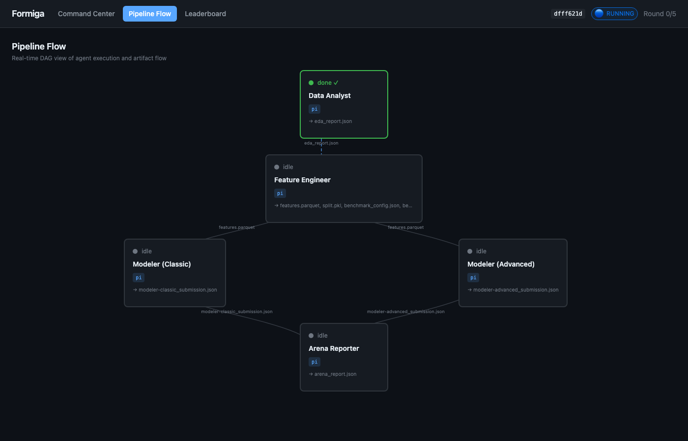
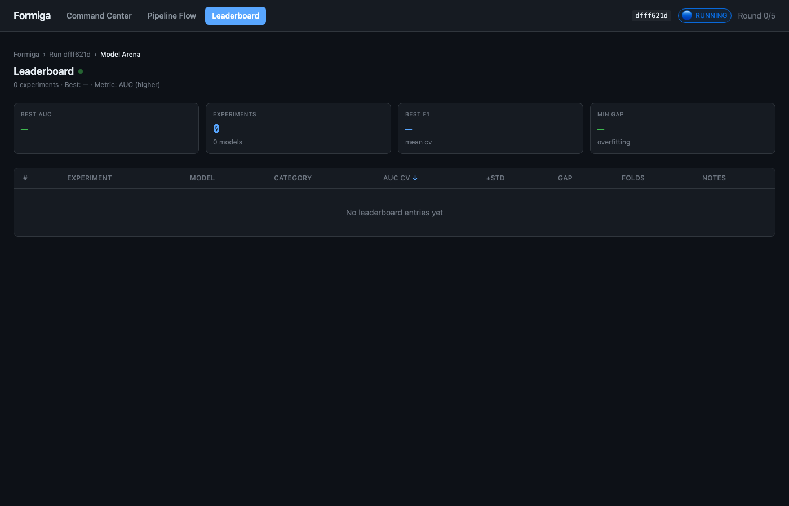

# Formiga

<p align="center"></p>

<p align="center">
  <a href="LICENSE"></a>
  = 22">
</p>

**AutoResearch for Data Science Teams** — A multi-agent system that automates the ML experimentation cycle: EDA, feature engineering, model training, and hyperparameter tuning.

### Why Formiga?

Data scientists spend 80% of their time on repetitive tasks: exploring data, engineering features, tuning hyperparameters, comparing models. Formiga automates this with a team of AI agents that work like data scientists — they explore, experiment, compete, and report back.

**What you get:**
- **Parallel experimentation** — Classic ML and Deep Learning agents compete simultaneously
- **Iterative improvement** — Arena runs multiple rounds until models converge
- **Full auditability** — Every experiment tracked, every decision logged
- **Live dashboard** — Watch agents work in real-time
---

## Quick Start

### 1. Prerequisites

- **Node.js 22+** — check with `node -v`
- **Coding-agent harness** — install one:
  - [pi](https://github.com/mariozechner/pi-coding-agent) (recommended)
  - [hermes](https://github.com/anthropics/anthropic-quickstarts/tree/main/computer-use-demo)

### 2. Install Formiga

```bash
git clone https://github.com/PJarbas/formiga.git
cd formiga && ./build-and-install
```

### 3. Run

```bash
# Start a competitive ML arena
formiga autoresearch "dataset_path=data/train.csv target_column=price"

# Open the dashboard
formiga dashboard start
open http://localhost:3334/
```

Agents will explore your data, engineer features, train models, and compete until convergence.

<p align="center"></p>

---

## How It Works

```
Data Analyst → Feature Engineer → Arena (Classic vs Advanced) → Reporter
                                      ↑_________|
                                    (repeats N rounds)
```

1. **Data Analyst** — EDA, data quality, correlations
2. **Feature Engineer** — features, train/val/test split, baseline model
3. **Arena** — Classic and Advanced modelers compete in rounds
4. **Reporter** — summarizes results when arena converges

---

## Workflows

| Workflow | Description | Command |
|----------|-------------|---------|
| **ml-autoresearch** | Competitive arena, multiple rounds | `formiga autoresearch "..."` |
| **ml-pipeline** | Single-pass with audit | `formiga workflow run ml-pipeline "..."` |

---

## Dashboard

<p align="center">
  
  
  
</p>

| Tab | Description |
|-----|-------------|
| **Command Center** | All runs with status and metrics |
| **Pipeline Flow** | Live DAG of agents |
| **Leaderboard** | Experiments sorted by CV score |

```bash
formiga dashboard start   # http://localhost:3334
formiga dashboard stop
```

---

## Commands

```bash
# Workflows
formiga autoresearch "dataset_path=... target_column=..."
formiga workflow run ml-pipeline "..."

# Run management
formiga workflow runs              # list
formiga workflow status <id>       # check
formiga workflow pause <id>        # pause
formiga workflow resume <id>       # resume
formiga workflow delete <id>       # delete permanently

# Debugging
formiga logs                       # recent
formiga logs-tail                  # live
formiga status                     # health check

# Setup
formiga get-ready                  # install workflows + start services
formiga update                     # pull + rebuild + restart
```

---

## Using Formiga from Other AI Agents

Formiga exposes a skill that Claude Code or other AI agents can use to run ML experiments programmatically.

### Install the Skill

```bash
# Add to your Claude Code skills
cp -r /path/to/formiga/skills/formiga-agents ~/.claude/skills/
```

### Example: Agent-Driven AutoResearch

An AI agent can run a full ML arena with this prompt:

```
You have access to Formiga, a multi-agent ML platform. 

Run AutoResearch on the dataset at /data/train.csv to predict "price":

formiga autoresearch "dataset_path=/data/train.csv target_column=price max_rounds=10"

Monitor progress with:
formiga logs-tail
formiga dashboard start && open http://localhost:3334/

The arena will automatically:
- Run EDA and feature engineering
- Spawn competing modelers (Classic ML vs Deep Learning)
- Iterate until convergence or max rounds
- Generate a final report with the best model
```

### Key Commands for Agents

```bash
# Start ML arena (ml-autoresearch workflow)
formiga autoresearch "dataset_path=/path/to/data.csv target_column=target"

# With options
formiga autoresearch "dataset_path=data.csv target_column=price max_rounds=5 metric=rmse direction=lower"

# Monitor progress
formiga logs-tail
formiga workflow status <run-id>

# Manage runs
formiga workflow runs              # list all
formiga workflow pause <run-id>    # pause
formiga workflow resume <run-id>   # resume
```

See [skills/formiga-agents/SKILL.md](skills/formiga-agents/SKILL.md) for the complete agent API.

---

## Architecture

```
CLI → SQLite (~/.formiga/formiga.db) → Daemon → Agents → Harness (pi/hermes)
                   ↑                                           |
            Dashboard API (:3334) ←────────────────────────────┘
```

See [docs/WORKFLOW-ARCHITECTURE.md](docs/WORKFLOW-ARCHITECTURE.md) for details.

---

## Development

```bash
./build              # builds and restarts services
npm test             # run tests
```

---

## License

[MIT](LICENSE)
