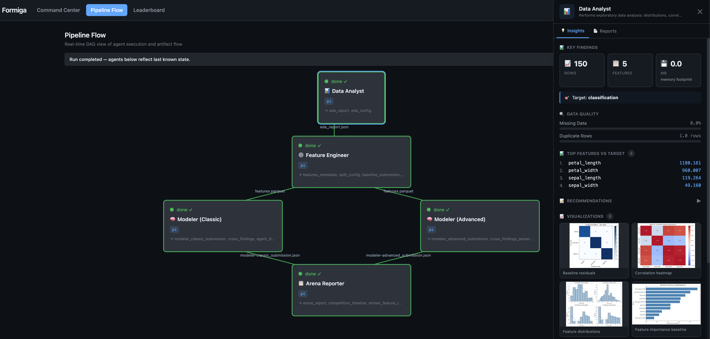
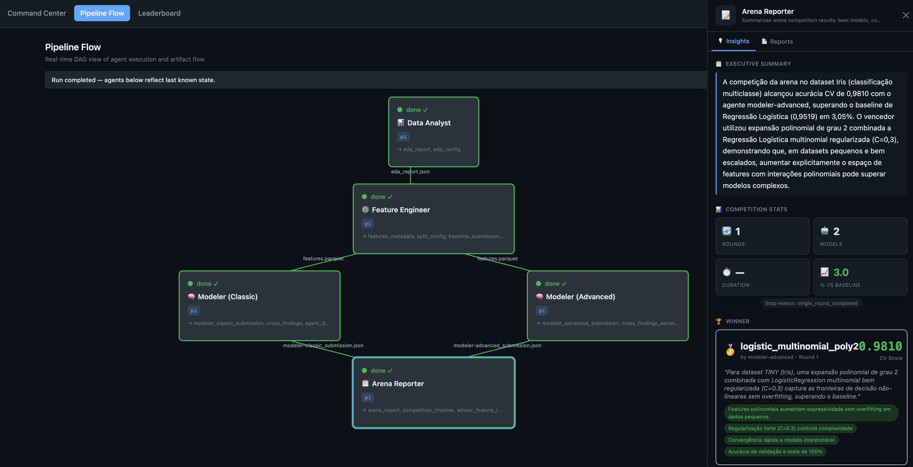
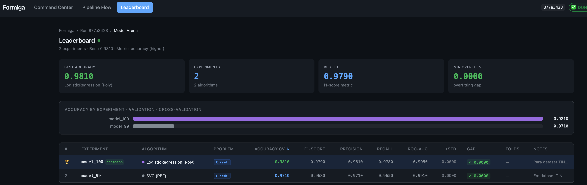

# Formiga 🐜

<p align="center"></p>

<p align="center">
  <a href="LICENSE"></a>
  = 22">
</p>

**AutoResearch for Data Science Teams** — A multi-agent system that automates the ML experimentation cycle: EDA, feature engineering, model training, hyperparameter tuning, and final reporting.

---

## Why Formiga?

Data scientists spend up to 80% of their time on repetitive tasks: exploring data, engineering features, tuning hyperparameters, and comparing models.

**Formiga** automates this end-to-end. It spawns a team of autonomous AI agents that work like a collaborative data science squad — exploring, experimenting, competing in a structured Arena, and delivering production-ready models.

**Key Features:**
- **Parallel Experimentation:** Classic ML and Deep Learning agents compete simultaneously.
- **Iterative Improvement (Arena):** The modeling loop runs for multiple rounds, adapting based on prior rounds' learnings.
- **Full Auditability:** Every feature transformation decision, model architecture, and hyperparameter set is logged.
- **Live Dashboard:** Watch the execution DAG, engineered features, and leaderboard rankings in real-time.

---

## How It Works

Formiga structures agent execution in a Directed Acyclic Graph (DAG) of specialized roles:

```
[ Data Analyst ] (Analyzes raw data and proposes recommendations)
       │
       ▼
[ Feature Engineer ] (Transforms features and trains baseline model)
       │
 ┌─────┴─────────────────────┐
 ▼                           ▼
[ Modeler Classic ]   [ Modeler Advanced ]  (Compete in multiple rounds in the Arena)
 └─────┬─────────────────────┘
       │ (Best model converges or max rounds reached)
       ▼
[ Arena Reporter ] (Consolidates the competition and writes final report)
```

### The Agents and Their Roles

1. **Data Analyst:**
   * **What it does:** Performs autonomous Exploratory Data Analysis (EDA).
   * **How it works:** Reads the training dataset, detects data quality issues (missing values, duplicates, outliers), calculates correlations, infers the problem type (classification or regression), and generates actionable feature engineering recommendations.

2. **Feature Engineer:**
   * **What it does:** Implements the EDA recommendations into executable Python code.
   * **How it works:** Applies feature transformations (polynomial features, ratio creation, target encoding), sets up the cross-validation strategy (e.g., *Stratified K-Fold* for classification), and trains a simple **baseline model** (like a Logistic or Linear Regression) to establish the benchmark score.

3. **Modeler (Classic):**
   * **What it does:** Explores established, lightweight Machine Learning algorithms.
   * **How it works:** Tests hypotheses using classic algorithms like *Random Forest*, *Support Vector Machines (SVM)*, or simple linear models with lightweight hyperparameter tuning for speed and stability.

4. **Modeler (Advanced):**
   * **What it does:** Experiments with high-performance algorithms and complex hyperparameter search spaces.
   * **How it works:** Utilizes state-of-the-art algorithms such as *XGBoost* or *LightGBM*, applying advanced polynomial feature scaling, regularizations, and aggressive tuning to beat the baseline.

5. **Arena Reporter:**
   * **What it does:** Consolidates all modeling history from the competition.
   * **How it works:** Compiles results across all rounds, identifies the winning model and algorithm, outlines the performance improvements over the baseline, and writes a comprehensive executive summary detailing what worked and what failed.

---

## Dashboard Walkthrough

Formiga's interactive dashboard allows you to monitor and audit agent activity and experimental results in real-time.

### 1. Pipeline Flow
A live graphical representation of agent execution. Clicking on any agent node reveals its insights, generated code, and diagnostic logs in the side panel.

* **Exploratory Data Analysis (EDA) Phase:**
  <p align="center"></p>
  - The Data Analyst's side panel lists data dimensions, quality flags (missing/duplicate rows), feature importances against the target, and recommendations.

* **Arena Reporter:**
  <p align="center"></p>
  - The Arena Reporter's side panel outlines the winner, absolute and percentage gains over the baseline, and structural insights learned during modeling.

### 2. Leaderboard
Centralizes and ranks every model produced during the Arena rounds.

* **Task-Adaptive Metrics:** The leaderboard table layout dynamically shifts depending on the problem type.
  * **Classification:** Displays cross-validation accuracy (`Accuracy CV`), F1-Score, Precision, Recall, and ROC-AUC.
  * **Regression:** Displays CV error, RMSE, MAE, and R²-Score.
* **Actual Algorithm Classes:** The panel displays the real trained Python class names (e.g., `LogisticRegression (Poly)` or `SVC (RBF)`) along with standard deviations to help you select the most robust model.

### 3. Winner Consolidation
Once the Arena converges or reaches the round limit, the winning model is crowned and the final report is compiled.

<p align="center"></p>

---

## Quick Start

### 1. Prerequisites

* **Node.js 22+** (check with `node -v`)
* **Coding-Agent Harness:** Formiga leverages an agent harness to run code. Install one of the supported harnesses:
  * **pi-coding-agent** (Highly Recommended) — Follow the installation steps on [pi](https://github.com/mariozechner/pi-coding-agent)
  * **hermes** — Excellent alternative for computer-use integrations: [hermes](https://github.com/anthropics/anthropic-quickstarts/tree/main/computer-use-demo)

### 2. Installation

Clone the repository and run the global build and installation script:

```bash
git clone https://github.com/PJarbas/formiga.git
cd formiga
./build-and-install
```

### 3. Running AutoResearch

Run your first automated research competition by providing a dataset and a target column:

```bash
# Start the competitive ML arena
formiga autoresearch "dataset_path=data/classification.csv target_column=species"

# In another terminal window, launch the interactive dashboard
formiga dashboard start
```
Navigate to [http://localhost:3334](http://localhost:3334) to watch the agents execute in real-time.

---

## Commands

```bash
# Execute workflows
formiga autoresearch "dataset_path=... target_column=..."
formiga workflow run ml-pipeline "..."

# Run Management
formiga workflow runs              # List all runs and statuses
formiga workflow status <id>       # View live status of a run
formiga workflow pause <id>        # Pause scheduling for an active run
formiga workflow resume <id>       # Resume a paused run
formiga workflow delete <id>       # Permanently delete a run and its records

# Dashboard
formiga dashboard start            # Start the dashboard UI on port 3334
formiga dashboard stop             # Stop the dashboard server

# Monitoring & Logs
formiga logs                       # View recent global daemon logs
formiga logs-tail                  # Stream live daemon logs
formiga status                     # Perform a daemon health check

# Maintenance
formiga get-ready                  # Install default workflows and prepare directories
formiga update                     # Pull latest commits, rebuild, and restart services
```

---

## Integrating with AI Agents (Claude Code Skill)

Formiga exposes a dedicated **Claude Code Skill** allowing other AI agents to execute and manage Machine Learning experiments programmatically.

### Install the Skill

Copy the skill directory to your local Claude Code skills path:

```bash
cp -r /path/to/formiga/skills/formiga-agents ~/.claude/skills/
```

### Example: Agent-Driven Research

You can prompt Claude Code (or any agent equipped with this skill) to run an ML experiment:

```text
You have access to Formiga, a multi-agent ML platform.

Run AutoResearch on the dataset at data/classification.csv to predict "species":

formiga autoresearch "dataset_path=data/classification.csv target_column=species max_rounds=5"

Monitor the pipeline progress. Once done, inspect the best model on the leaderboard and summarize which features and algorithms yielded the highest validation score.
```

### Core Commands for Agents

```bash
# Start competitive ML Arena (runs ml-autoresearch workflow)
formiga autoresearch "dataset_path=path/to/data.csv target_column=target"

# Start with detailed constraints
formiga autoresearch "dataset_path=data.csv target_column=price max_rounds=8 metric=rmse direction=lower"

# Monitor progress
formiga workflow runs
formiga logs-tail
```

See [skills/formiga-agents/SKILL.md](skills/formiga-agents/SKILL.md) for the full agent API and parameters.

---

## Architecture

Formiga is designed to be highly lightweight, asynchronous, and resilient:

```
CLI (Commands) ──┐
                 ▼
          SQLite Database (stored at ~/.formiga/formiga.db)
                 ▲
                 ├─ Daemon (Orchestrates the agent DAG and handles chron schedule)
                 │     │
                 │     ▼
                 │   Agent Harness (pi or hermes)
                 │     │
                 │     ▼
                 │   AI Agents (Data Analyst, Feature Engineer, Modelers)
                 ▲     │
                 │     ▼
Dashboard API (:3334) ◄─ Publishes rich metrics and artifacts
```

For details regarding the orchestrator and daemon schemas, refer to [docs/WORKFLOW-ARCHITECTURE.md](docs/WORKFLOW-ARCHITECTURE.md).

---

## Development

To build and run tests locally:

```bash
./build              # Compiles TypeScript and restarts background services
npm test             # Runs test suite
```

---

## License

This project is licensed under the MIT License - see the [LICENSE](LICENSE) file for details.
