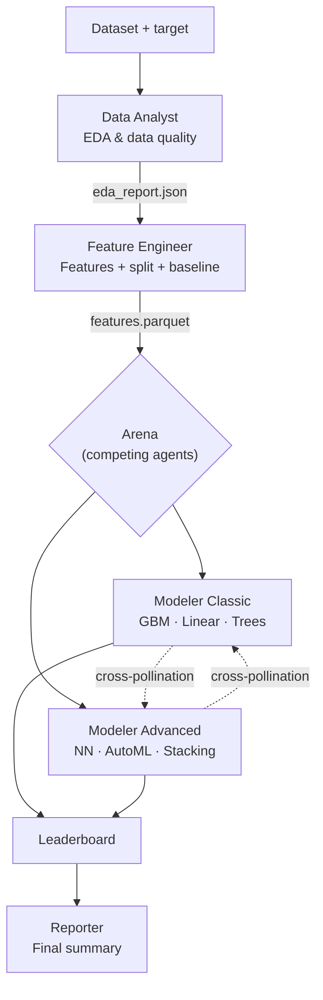
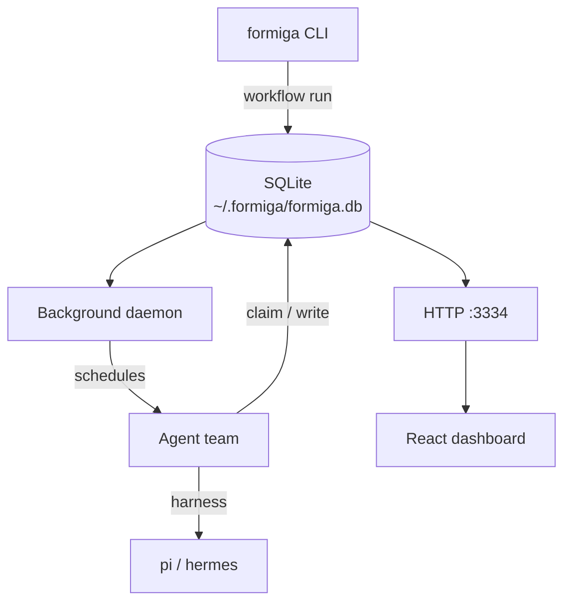

# Formiga

<p align="center"></p>

<p align="center">
  <a href="LICENSE"></a>
  = 22">
  
</p>

Formiga is a **Multi-Agent ML Platform**. Point it at a dataset, walk away, and let AI agents compete to build the best model. Every experiment is tracked, every decision is auditable, and you can watch it all unfold in real-time.

<p align="center"><b>A CLI that orchestrates a team of specialist AI agents — Data Analyst, Feature Engineer, competing Modelers, and an adversarial ML Critic — through a deterministic, resumable workflow.</b></p>

No Redis. No Kubernetes. No YAML soup. Just Node, SQLite, and a live dashboard.

---

## Quick Start

### 1. Install

```bash
# One-line install
curl -fsSL https://raw.githubusercontent.com/PJarbas/formiga/main/scripts/install.sh | bash

# Or from source
git clone https://github.com/PJarbas/formiga.git
cd formiga && ./build-and-install
```

Requires **Node.js 22+** and the [hermes](https://github.com/anthropics/anthropic-quickstarts/tree/main/computer-use-demo) or [pi](https://github.com/mariozechner/pi-coding-agent) coding-agent harness.

### 2. Run AutoResearch

```bash
# Point at your CSV and let Formiga do the rest
formiga autoresearch "dataset_path=data/train.csv target_column=price"

# Open the dashboard to watch progress
formiga dashboard start
open http://localhost:3334/
```

That's it! Agents will explore your data, engineer features, train models, and compete in an arena.

<p align="center"></p>

---

## What Happens When You Run It



1. **Data Analyst** explores your dataset — distributions, missing values, correlations — and produces an EDA report.
2. **Feature Engineer** builds features, creates train/val/test splits, and trains a baseline model every competitor must beat.
3. **Arena** runs multiple rounds where Classic and Advanced modelers compete in parallel, sharing insights between rounds.
4. Each experiment is tracked on a **live leaderboard** in the dashboard.
5. **Reporter** summarizes the competition: best model, key learnings, performance metrics.

Everything is deterministic and resumable. Stop it, restart your laptop, resume it.

---

## The Agent Team

| Agent | Role | What It Does |
|-------|------|--------------|
| **Data Analyst** | EDA | Explores data quality, distributions, correlations, outliers |
| **Feature Engineer** | Prep | Builds features, canonical split, baseline model |
| **Modeler Classic** | ML | Gradient boosting, linear, tree-based, SVM, stacking |
| **Modeler Advanced** | ML | Neural nets, AutoML, transformers, deep stacking |
| **ML Critic** | Audit | Read-only adversarial checks (overfitting, leakage, inflation) |
| **Reporter** | Summary | Final competition report with insights |

Each agent has its own persona, workspace, and acceptance criteria. The ML Critic is read-only — it audits but cannot modify models.

---

## Dashboard

A real-time dashboard at `http://localhost:3334` with three views:

| View | What You See |
|------|--------------|
| **Command Center** | All pipeline runs with status, timing, and metrics |
| **Pipeline Flow** | Live DAG visualization of agents and artifact flow |
| **Leaderboard** | Sortable experiment table with metrics and comparisons |

<p align="center">
  
  
</p>

```bash
formiga dashboard start   # Start at localhost:3334
formiga dashboard stop    # Stop the server
formiga dashboard status  # Check if running
```

---

## Choosing a Harness

Formiga uses a coding-agent harness to execute agent steps. Two options:

```bash
# Hermes (default) — recommended
formiga autoresearch "dataset_path=data/train.csv target_column=price" --hermes-as-harness

# Pi — alternative harness
formiga autoresearch "dataset_path=data/train.csv target_column=price" --pi-as-harness
```

Harness binary is validated at scheduling time — if missing, the run fails immediately with a clear error.

---

## Common Commands

**Running workflows:**

```bash
# AutoResearch (recommended) — competitive arena with multiple rounds
formiga autoresearch "dataset_path=data/train.csv target_column=price"

# ML Pipeline — single-pass 5-agent pipeline
formiga workflow run ml-pipeline "dataset_path=data/train.csv target_column=price"
```

**Managing runs:**

```bash
formiga workflow runs              # List all runs
formiga workflow status <run-id>   # Check specific run
formiga workflow pause <run-id>    # Pause a run
formiga workflow resume <run-id>   # Resume paused run
formiga workflow stop <run-id>     # Cancel a run
```

**Logs and debugging:**

```bash
formiga logs                       # Recent activity
formiga logs-tail                  # Follow live
formiga status                     # System health check
```

**Lifecycle:**

```bash
formiga get-ready                  # Install workflows + start services
formiga update                     # Pull, rebuild, restart
formiga uninstall                  # Full teardown
```

Every command has `--help` for details.

---

## Architecture

Formiga is a **TypeScript CLI + SQLite + polling** orchestrator. No external services required.



Everything lives in `~/.formiga/formiga.db`:
- `runs` — workflow executions with status and timing
- `steps` — agent steps with claim/complete/fail lifecycle
- `experiments` — the leaderboard
- `arena_sessions` — competition state
- `agent_artifacts` — structured data exchange between agents

---

## REST API

The dashboard is backed by a REST API you can use programmatically:

```bash
# Pipeline
curl http://localhost:3334/api/pipeline/status
curl http://localhost:3334/api/pipeline/flow

# Leaderboard
curl http://localhost:3334/api/leaderboard
curl http://localhost:3334/api/leaderboard/current-best?runId=<id>

# Runs
curl http://localhost:3334/api/runs
curl http://localhost:3334/api/runs/<id>

# Control
curl -X POST http://localhost:3334/api/pipeline/pause
curl -X POST http://localhost:3334/api/pipeline/resume
```

---

## Custom Workflows

Create your own agent workflows with YAML:

```yaml
id: my-workflow
name: My Custom Workflow

agents:
  - id: researcher
    name: Researcher
    workspace:
      files:
        AGENTS.md: agents/researcher/AGENTS.md

steps:
  - id: research
    agent: researcher
    input: |
      Research {{task}} and report findings.
      Reply with STATUS: done and FINDINGS: ...
    expects: "STATUS: done"
```

Full guide: [docs/creating-workflows.md](docs/creating-workflows.md)

---

## Requirements

- **Node.js >= 22** (uses native `node:sqlite`)
- **[hermes](https://github.com/anthropics/anthropic-quickstarts)** or **[pi](https://github.com/mariozechner/pi-coding-agent)** — coding-agent harness
- **`gh` CLI** — optional, for GitHub integration

---

## Development

```bash
./build              # npm install + tsc + vite build
npm test             # Unit + integration tests
./run-all-e2e-tests  # Fast smoke tests
```

See [docs/AGENTS.md](docs/AGENTS.md) for architecture and conventions.

---

## License

[MIT](LICENSE)

---

## Origins

Formiga began as a fork of [antfarm](https://github.com/snarktank/antfarm) and pursues the same goal — orchestrating teams of AI agents through deterministic, repeatable workflows. Credit to the original authors for the design and inspiration.
