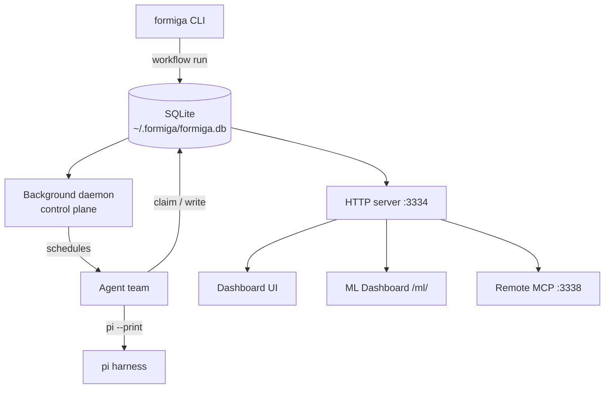
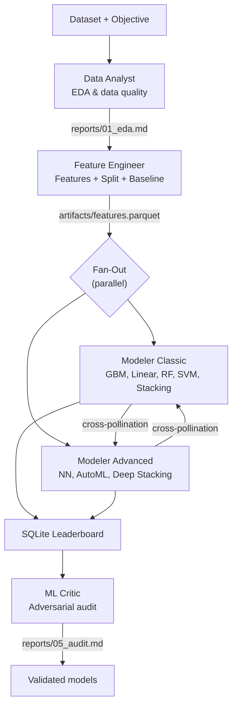
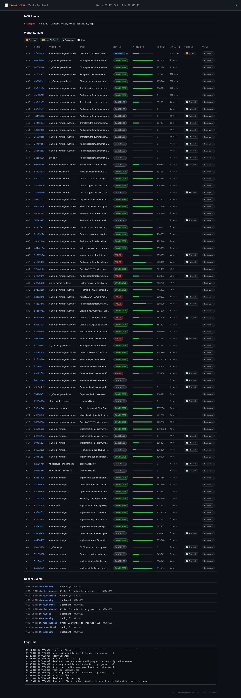

# Formiga

<p align="center"></p>

<p align="center">
  <a href="LICENSE"></a>
  = 22">
  
  
</p>

**Autonomous ML pipeline orchestration with competitive agent teams.** Formiga lets you define a team of specialized AI agents — Data Analyst, Feature Engineer, parallel Modelers, and an adversarial ML Critic — that work together through deterministic, repeatable workflows to find the best model for your data.

## Contents

- [Install](#install)
- [Quickstart](#quickstart)
- [Architecture](#architecture)
- [ML Pipeline](#ml-pipeline)
- [Agent Team](#agent-team)
- [Dashboard](#dashboard)
- [Leaderboard](#leaderboard)
- [AutoResearch](#autoresearch)
- [Workflows](#workflows)
- [Commands](#commands)
- [Requirements](#requirements)
- [License](#license) · [Origins](#origins)

## Install

```bash
curl -fsSL https://raw.githubusercontent.com/PJarbas/formiga/main/scripts/install.sh | bash
```

Or from a local checkout:

```bash
git clone https://github.com/PJarbas/formiga.git
cd formiga
./build-and-install
```

The `build` script requires Node.js >= 22, runs `npm install`, compiles TypeScript, and builds the React dashboard. The `install` script creates a symlink at `~/.local/bin/formiga` — keep the source wherever you like.

```bash
./build        # npm install + tsc + vite build
./install      # symlink ~/.local/bin/formiga → this checkout
```

## Quickstart

```bash
# Install bundled workflows and start services
$ formiga get-ready

# Start the ML dashboard
$ formiga dashboard start

# Run the ML pipeline on your dataset
$ formiga workflow run just-do-it \
    "Run the full ML pipeline on data/train.csv with target column 'price'"
```

Open `http://localhost:3334/ml/` to watch your agent team work in real time.

## Architecture

Formiga is a **TypeScript CLI + SQLite + polling** system. No Redis, no Kafka, no containers. Agents poll for work independently, claim steps, and pass context through the database.



### State

Everything lives in SQLite at `~/.formiga/formiga.db`:

| Table | Purpose |
|-------|---------|
| `runs` | Workflow execution runs with status, tokens, timing |
| `steps` | Individual agent steps with claim/complete/fail lifecycle |
| `stories` | User stories for story-based development workflows |
| `experiments` | ML experiment results — the leaderboard |
| `autoresearch_sessions` | Durable optimization loop state |
| `run_worktrees` | Git worktree isolation metadata |

## ML Pipeline

Formiga's core is a **competitive ML pipeline** where agents with different modeling philosophies compete to find the best solution, then an adversarial critic audits the results.



### How it works

1. **Data Analyst** explores distributions, missing values, outliers, correlations — produces a rigorous EDA report
2. **Feature Engineer** builds features, creates train/val/test splits, and trains a baseline model
3. **Fan-Out**: Two modelers run in **parallel** with different approaches:
   - **Modeler Classic**: GBM, linear models, random forest, SVM, L1 stacking
   - **Modeler Advanced**: neural networks, AutoML, multi-level stacking
   - They **cross-pollinate** findings in real time via inter-agent messages
4. **Fan-In**: Results are collected and registered in the **leaderboard**
5. **ML Critic** (read-only auditor) checks for overfitting, data leakage, and inflated metrics
6. The best validated model wins

Each round improves on the previous. The orchestrator tracks round state, timeouts, and automatic leaderboard registration.

## Agent Team

| Agent | Role | Tools | Model |
|-------|------|-------|-------|
| `data-analyst` | Exploratory data analysis | Read, Bash, Glob, Grep | Claude Sonnet |
| `feature-engineer` | Feature extraction, splits, baseline | Read, Write, Bash, Glob, Grep | Claude Sonnet |
| `modeler-classic` | Traditional ML (GBM, RF, SVM, Stacking) | Read, Write, Bash, Glob, Grep | Claude Opus |
| `modeler-advanced` | Neural nets, AutoML, deep stacking | Read, Write, Bash, Glob, Grep | Claude Opus |
| `ml-critic` | Adversarial audit (read-only) | Read, Bash, Glob, Grep | Claude Opus |

Each agent has a strict persona, workspace, and acceptance criteria. The ML Critic is deliberately read-only — it audits but cannot modify models.

## Dashboard

The dashboard serves two UIs from the same `http` server (default port 3334):

| Path | Screen | Description |
|------|--------|-------------|
| `/` | Workflow Kanban | Swim-lane view of workflow runs with step/story cards |
| `/ml/` | Pipeline Overview | Active run status, 5 agent cards, quick stats |
| `/ml/kanban` | ML Kanban | Per-agent experiment cards grouped by status |
| `/ml/leaderboard` | Leaderboard | Sortable model table + CV mean evolution chart |
| `/ml/agents/:name` | Agent Detail | Agent plan, trials, paginated logs |

The ML dashboard is a **React 18 SPA** with real-time polling (TanStack Query, 3-second interval) and **ECharts** visualization.

<p align="center"></p>

### API Endpoints

All ML endpoints live under `/api/` on the same server:

| Endpoint | Description |
|----------|-------------|
| `GET /api/pipeline/status` | Active pipeline run, phase, round, stats |
| `GET /api/agents` | List all 5 ML agents with current status |
| `GET /api/agents/:name` | Agent detail: plan, trials, last error |
| `GET /api/agents/:name/logs` | Paginated agent logs (offset/limit) |
| `GET /api/leaderboard` | Ranked experiments with filters and sorting |
| `GET /api/leaderboard/:id` | Single experiment detail |
| `GET /api/leaderboard/compare` | Compare 2+ experiments by metric |
| `GET /api/rounds` | Round summaries for a pipeline run |
| `GET /api/cross-findings` | Cross-pollination findings between modelers |
| `POST /api/pipeline/pause` | Pause active pipeline |
| `POST /api/pipeline/resume` | Resume paused pipeline |
| `POST /api/pipeline/cancel` | Cancel active pipeline |

## Leaderboard

The leaderboard is a **competitive ranking** of all model experiments across rounds and agents. Every experiment is stored in SQLite with:

- Model type, agent name, round number
- Hyperparameters (JSON)
- Train, validation, and test metrics
- Status (SUCCESS, FAILED, AUDITED, OVERFITTED)
- Artifact path for model binaries

```bash
# Query from the API
curl http://localhost:3334/api/leaderboard?sortBy=cvMean&sortDir=desc

# Filter by agent and round
curl http://localhost:3334/api/leaderboard?agentName=modeler-classic&roundNumber=2

# Compare two experiments
curl "http://localhost:3334/api/leaderboard/compare?id=1&id=2"
```

The leaderboard table at `/ml/leaderboard` shows an interactive sortable grid with an ECharts line chart tracking CV mean and train mean evolution across rounds.

## AutoResearch

Durable, measurable optimization loops. AutoResearch stores project-local state so an agent can resume after restarts, learn from each measured run, and choose the next experiment from evidence.

```bash
# Initialize a session
formiga autoresearch init \
  --goal "reduce validation loss" \
  --metric val_bpb \
  --direction lower \
  --command "uv run train.py"

# Run one experiment
formiga autoresearch run-experiment

# Log what was learned
formiga autoresearch log-experiment --status auto \
  --description "lower learning rate" \
  --hypothesis "smaller LR improves stability" \
  --learned "validation improved, training slowed" \
  --next-focus "test warmup schedule"

# Get the next focus prompt
formiga autoresearch next
```

Project files (live in your project directory):

| File | Purpose |
|------|---------|
| `autoresearch.config.json` | Session config: goal, metric, direction, command |
| `autoresearch.md` | Agent-facing objective and operating loop |
| `autoresearch.jsonl` | Append-only run history with decisions and learning |
| `autoresearch.sh` | Benchmark command |

## Workflows

Formiga ships with **3 bundled workflows** — composable primitives for agent orchestration:

| Workflow | Agents | Description |
|----------|--------|-------------|
| `do-now` | 1 | Submit any task. Get back a success/failure report. No planning. |
| `just-do-it` | 1 | Describe your goal. Auto-dispatches to the best approach. For ML tasks, runs the full pipeline with all 5 agents. |
| `do-review-do-verify` | 3 | Two-pass execution: do the work, review it, revise, then verify. |

Install them in one command:

```bash
formiga workflow install --all
```

### Build your own

Define agents, steps, retry logic, and verification gates in YAML:

```yaml
id: my-workflow
name: My Custom Workflow
agents:
  - id: researcher
    name: Researcher
    workspace:
      files:
        AGENTS.md: agents/researcher/AGENTS.md

steps:
  - id: research
    agent: researcher
    input: |
      Research {{task}} and report findings.
      Reply with STATUS: done and FINDINGS: ...
    expects: "STATUS: done"
```

Full guide: [docs/creating-workflows.md](docs/creating-workflows.md)

## Commands

### Lifecycle

| Command | Description |
|---------|-------------|
| `formiga get-ready` | Install bundled workflows, start dashboard and control plane |
| `formiga source-path` | Print the Formiga source checkout path |
| `formiga skill-path` | Print path to bundled formiga-agents skill |
| `formiga update [--force]` | Pull source, rebuild, reinstall workflows, restart services |
| `formiga uninstall [--force]` | Full teardown (agents, crons, DB) |
| `formiga status` | Show system status: services, paths, runs, processes |

### Workflows

| Command | Description |
|---------|-------------|
| `formiga workflow run <id> <task>` | Start a run |
| `formiga workflow status <query>` | Check run status |
| `formiga workflow runs` | List all runs |
| `formiga workflow list` | List available workflows |
| `formiga workflow install <id>` | Install a workflow |
| `formiga workflow uninstall <id>` | Remove a workflow |
| `formiga workflow pause <run-id>` | Pause a running workflow |
| `formiga workflow resume <run-id>` | Resume a paused workflow |
| `formiga workflow delete <run-id>` | Permanently delete a run |

### Dashboard & MCP

| Command | Description |
|---------|-------------|
| `formiga dashboard start` | Start web UI at `http://localhost:3334` + remote MCP at `http://localhost:3338/mcp` |
| `formiga dashboard stop` | Stop dashboard daemon |
| `formiga dashboard status` | Verify both endpoints are up |

### Remote MCP Tools

The MCP endpoint exposes 14 tools for external agent integration:

| Tool | Description |
|------|-------------|
| `formiga.runs.list` | List recent workflow runs |
| `formiga.run.status` | Detailed run status |
| `formiga.run.start` | Start a workflow run |
| `formiga.run.pause` / `.resume` | Pause/resume runs |
| `formiga.run.delete` | Delete a run and all associated data |
| `formiga.events.recent` | Recent global events |
| `formiga.source.path` | Formiga source checkout path |
| `formiga.skill.path` | Bundled skill path |
| `formiga.update.command` | Update guidance |
| `formiga.autoresearch.init` | Create AutoResearch session |
| `formiga.autoresearch.run_experiment` | Run experiment command |
| `formiga.autoresearch.log_experiment` | Log decision and learning |
| `formiga.autoresearch.status` | Summarize experiment loop |

### AutoResearch

| Command | Description |
|---------|-------------|
| `formiga autoresearch init` | Create project-local session |
| `formiga autoresearch run-experiment` | Execute experiment command |
| `formiga autoresearch log-experiment` | Record learning and decision |
| `formiga autoresearch status` | Summarize experiment loop |
| `formiga autoresearch next` | Print next experiment prompt |
| `formiga autoresearch loop` | Run bounded experiment loop |
| `formiga autoresearch prune` | Clean stale registry entries |

### Logs & Debugging

| Command | Description |
|---------|-------------|
| `formiga logs [<lines>\|<run-id>\|#<run-number>]` | View recent events |
| `formiga logs-tail [<lines>\|<run-id>\|#<run-number>]` | Follow events in real time |
| `formiga nudge` | Wake all scheduled agents immediately |

## Requirements

- **Node.js >= 22** (native `node:sqlite`)
- **[pi](https://github.com/mariozechner/pi-coding-agent)** — AI coding agent CLI used as the agent harness
- **`gh` CLI** — for GitHub PR integration

## Development

```bash
# Build from source
./build

# Run tests (unit + integration, parallel-safe)
npm test

# Run e2e smoke tests (fast, no real agents)
./run-all-e2e-tests
```

Tests use Node's built-in `node:test` runner with isolated temporary HOME directories — safe for parallel execution. See [AGENTS.md](AGENTS.md) for architecture details, project structure, and development conventions.

## License

[MIT](LICENSE)

## Origins

Formiga began as a fork of [antfarm](https://github.com/snarktank/antfarm) and pursues the same goal — orchestrating teams of AI agents through deterministic, repeatable workflows — built on top of [pi](https://github.com/mariozechner/pi-coding-agent). Credit to the original authors for the design and inspiration.
