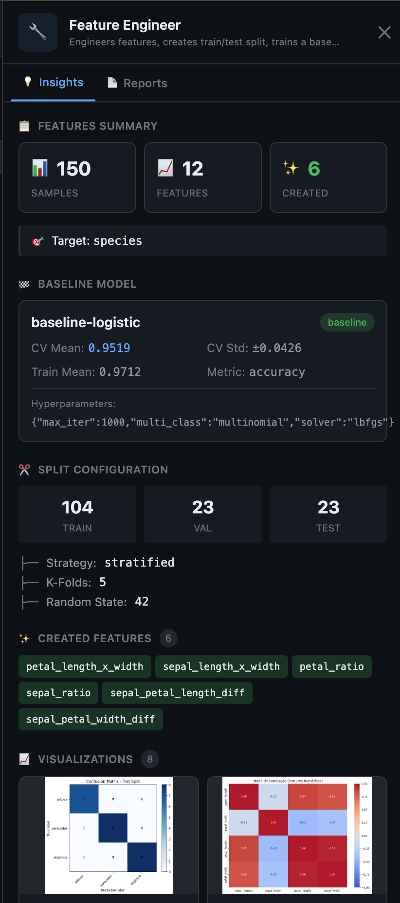

# Formiga 🐜

<p align="center"></p>

<p align="center">
  <a href="LICENSE"></a>
  = 22">
</p>

**AutoResearch para Equipes de Ciência de Dados** — Um sistema multi-agente que automatiza o ciclo completo de experimentos de Machine Learning: Análise Exploratória (EDA), Engenharia de Features, Treinamento de Modelos, Tuning de Hiperparâmetros e Relatório Final.

---

## Por que Formiga?

Cientistas de dados gastam até 80% do tempo em tarefas repetitivas: limpando dados, experimentando novas transformações de features, testando múltiplos algoritmos e ajustando hiperparâmetros.

O **Formiga** automatiza todo esse fluxo de forma inteligente. Ele simula uma equipe de ciência de dados autônoma onde agentes especializados colaboram, experimentam em paralelo, competem em uma Arena estruturada e geram modelos prontos para produção.

**O que o Formiga oferece:**
- **Experimentação em Paralelo:** Agentes modeladores (Clássico e Avançado) competem simultaneamente para ver quem descobre o melhor modelo.
- **Melhoria Iterativa (Arena):** O ciclo de modelagem roda por múltiplos rounds de forma adaptativa com base no feedback das rodadas anteriores.
- **Auditabilidade Total:** Cada decisão de engenharia de features, cada arquitetura de modelo e hiperparâmetro testado é registrado de forma estruturada.
- **Dashboard em Tempo Real:** Acompanhe visualmente a execução da DAG de agentes, as features criadas e a evolução da liderança de modelos.

---

## Como Funciona o Fluxo de Execução?

O Formiga organiza a execução em uma DAG (Grafo Direcionado Acíclico) de agentes especializados, operando de forma sequencial e concorrente:

```
[ Data Analyst ] (Analisa os dados originais e propõe melhorias)
       │
       ▼
[ Feature Engineer ] (Cria as features e estabelece o baseline)
       │
 ┌─────┴─────────────────────┐
 ▼                           ▼
[ Modeler Classic ]   [ Modeler Advanced ]  (Competem em múltiplos rounds na Arena)
 └─────┬─────────────────────┘
       │ (Melhor modelo converge/atinge rounds máximos)
       ▼
[ Arena Reporter ] (Consolida a competição e escreve o relatório final)
```

### Os Agentes e Suas Funções

1. **Data Analyst (Analista de Dados):**
   * **O que faz:** Realiza a Análise Exploratória de Dados (EDA) de forma totalmente autônoma.
   * **Como atua:** Lê o dataset de treino, detecta problemas de qualidade (dados ausentes, duplicados, outliers), calcula correlações, identifica o tipo de problema (classificação ou regressão) e propõe recomendações de transformações para otimizar a modelagem.

2. **Feature Engineer (Engenheiro de Features):**
   * **O que faz:** Transforma as recomendações de EDA em código Python executável.
   * **Como atua:** Aplica transformações (como polinômios, divisões de features, target encoding), define a estratégia ideal de validação cruzada (ex: *Stratified K-Fold* para classificação) e treina um **modelo baseline** inicial simples (como uma Regressão Logística ou Linear) para servir como ponto de partida da competição.

3. **Modeler (Classic - Modelador Clássico):**
   * **O que faz:** Explora algoritmos consolidados e eficientes de Machine Learning.
   * **Como atua:** Testa hipóteses usando modelos clássicos como *Random Forest*, *Support Vector Machines (SVM)* ou modelos lineares simples, ajustando hiperparâmetros leves que garantam estabilidade e rapidez.

4. **Modeler (Advanced - Modelador Avançado):**
   * **O que faz:** Experimenta técnicas de alta performance, algoritmos robustos de boosting ou transformações não-lineares agressivas.
   * **Como atua:** Trabalha com algoritmos de ponta, tais como *XGBoost*, *LightGBM*, ou cria pipelines complexos aplicando engenharia de features polinomial profunda e buscas rigorosas de hiperparâmetros.

5. **Arena Reporter (Relator da Arena):**
   * **O que faz:** Consolida toda a história da competição de Machine Learning.
   * **Como atua:** Analisa as rodadas da arena, aponta qual foi o agente e o algoritmo vencedor, detalha os ganhos de performance obtidos em relação ao baseline de partida, e escreve um sumário executivo em linguagem natural explicando o que funcionou e o que falhou durante os rounds.

---

## Visualizando o Processo no Dashboard

O dashboard interativo do Formiga permite monitorar e investigar todo o ciclo de vida dos agentes e modelos em tempo real.

### 1. Fluxo da Pipeline (Pipeline Flow)
Permite visualizar em tempo real a execução de cada agente. Ao clicar em um agente, o painel lateral exibe suas descobertas, código e estatísticas.

* **Fase de Análise de Dados:**
  <p align="center"></p>
  *O painel lateral exibe o número de linhas, colunas, qualidade dos dados (missing/duplicados), as features mais importantes correlacionadas com o target e recomendações geradas pelo **Data Analyst**.*

* **Fase de Engenharia de Features:**
  <p align="center"></p>
  *O painel lateral detalha as novas features geradas (ex: interações polinomiais), a distribuição exata de divisões (Train/Val/Test), a métrica obtida pelo modelo baseline (`baseline-logistic`) e os gráficos gerados automaticamente de matriz de confusão ou mapa de calor residual.*

### 2. Leaderboard de Experimentos (Leaderboard)
Centraliza a comparação e o ranking de todos os modelos criados pelos modeladores durante os múltiplos rounds da Arena.

<p align="center"></p>

* **Adaptabilidade ao Problema:** O Leaderboard adapta suas colunas e métricas automaticamente dependendo do tipo de problema.
  * **Classificação:** Exibe acurácia média de validação cruzada (`Accuracy CV`), F1-Score, Precision, Recall e ROC-AUC.
  * **Regressão:** Exibe erro médio de validação cruzada, RMSE, MAE e R²-Score.
* **Algoritmos Reais:** O painel mostra o nome real do algoritmo treinado no Python (ex: `LogisticRegression (Poly)` ou `SVC (RBF)`) e o desvio padrão da validação cruzada para garantir que você escolha o modelo mais estável.

### 3. Consolidação e Modelo Campeão
Quando os modelos param de evoluir ou atingem o limite de rodadas, a arena converge e o relatório final é entregue pelo **Arena Reporter**.

<p align="center"></p>
*O Arena Reporter exibe o resumo executivo, estatísticas de evolução (melhoria percentual versus o baseline de partida) e as métricas do modelo campeão final.*

---

## Quick Start (Início Rápido)

### 1. Pré-requisitos

* **Node.js 22+** (verifique com `node -v`)
* **Coding-Agent Harness (Harness de Execução de Agentes):** O Formiga utiliza um harness para delegar tarefas de execução aos agentes de IA. Instale um dos suportados:
  * **pi-coding-agent** (Altamente Recomendado) — Instale seguindo o repositório oficial: [pi](https://github.com/mariozechner/pi-coding-agent)
  * **hermes** — Excelente alternativa para uso com computer-use: [hermes](https://github.com/anthropics/anthropic-quickstarts/tree/main/computer-use-demo)

### 2. Instalação do Formiga

Clone o repositório e execute o script de compilação e instalação global:

```bash
git clone https://github.com/PJarbas/formiga.git
cd formiga
./build-and-install
```

### 3. Rodando sua primeira Auto-Pesquisa

Inicie uma pesquisa de ML indicando seu dataset e a coluna alvo:

```bash
# Inicia a arena competitiva de ML
formiga autoresearch "dataset_path=data/classification.csv target_column=species"

# Abra o dashboard interativo em outra janela do terminal
formiga dashboard start
```
Abra o seu navegador em [http://localhost:3334](http://localhost:3334) para acompanhar os agentes em tempo real.

---

## Comandos Disponíveis

```bash
# Executar pesquisas e fluxos
formiga autoresearch "dataset_path=... target_column=..."
formiga workflow run ml-pipeline "..."

# Gerenciamento de Execuções (Runs)
formiga workflow runs              # Lista todas as runs cadastradas
formiga workflow status <id>       # Consulta o status atual de uma run
formiga workflow pause <id>        # Pausa os agendamentos de uma run ativa
formiga workflow resume <id>       # Retoma uma run pausada
formiga workflow delete <id>       # Deleta uma run permanentemente do banco

# Dashboard
formiga dashboard start            # Inicializa a interface web na porta 3334
formiga dashboard stop             # Para o serviço do dashboard

# Logs e Diagnósticos
formiga logs                       # Exibe as últimas linhas de log global do daemon
formiga logs-tail                  # Segue os logs do daemon ao vivo
formiga status                     # Verifica a saúde do daemon do Formiga

# Configuração e Manutenção
formiga get-ready                  # Prepara o ambiente instalando fluxos padrão
formiga update                     # Atualiza o código, recompila e reinicia os serviços
```

---

## Usando o Formiga a partir de Outros Agentes de IA (Skill do Claude Code)

O Formiga expõe uma **Skill** dedicada de Claude Code para que agentes de IA possam executar e gerenciar experimentos de Machine Learning de forma programática.

### Instalação da Skill no Claude Code

Para registrar a skill dentro do seu ambiente do Claude Code local, copie a pasta da skill:

```bash
cp -r /caminho/para/formiga/skills/formiga-agents ~/.claude/skills/
```

### Exemplo de Uso: Prompt para Claude Code rodar experimentos

Você pode instruir o Claude Code (ou outro agente de IA equipado com a skill) a rodar pesquisas de machine learning fornecendo um prompt como o seguinte:

```text
Você tem acesso ao Formiga, uma plataforma multi-agente de Machine Learning.

Execute uma pesquisa AutoResearch no dataset em data/classification.csv para prever a coluna "species":

formiga autoresearch "dataset_path=data/classification.csv target_column=species max_rounds=5"

Monitore o progresso do pipeline e as métricas na Arena. Quando concluído, verifique qual foi o modelo campeão no leaderboard e me diga quais transformações de features e algoritmos trouxeram o melhor resultado.
```

### Comandos de Integração Essenciais para Agentes

```bash
# Iniciar Arena Autônoma de Machine Learning
formiga autoresearch "dataset_path=caminho/dados.csv target_column=alvo"

# Executar especificando limite de rounds, métrica base e direção de otimização
formiga autoresearch "dataset_path=data.csv target_column=price max_rounds=8 metric=rmse direction=lower"

# Monitoramento de agendamentos e filas
formiga workflow runs
formiga logs-tail
```

Para especificações profundas de contratos e parâmetros suportados da skill, veja [skills/formiga-agents/SKILL.md](skills/formiga-agents/SKILL.md).

---

## Arquitetura de Comunicação

O Formiga foi construído para ser incrivelmente leve, rodando de forma desacoplada e resiliente a falhas:

```
CLI (Comandos) ──┐
                 ▼
          Banco SQLite (armazenado em ~/.formiga/formiga.db)
                 ▲
                 ├─ Daemon (Orquestra a DAG de agentes e gerencia o cron)
                 │     │
                 │     ▼
                 │   Harness de Execução (pi ou hermes)
                 │     │
                 │     ▼
                 │   Agentes de IA (Data Analyst, Feature Engineer, Modelers)
                 ▲     │
                 │     ▼
Dashboard API (Porta :3334) ◄─ Escreve métricas e artefatos
```

Para mais detalhes sobre as especificações do motor de orquestração, consulte [docs/WORKFLOW-ARCHITECTURE.md](docs/WORKFLOW-ARCHITECTURE.md).

---

## Contribuição e Desenvolvimento

Para testar ou desenvolver o Formiga localmente:

```bash
./build              # Compila e reinicia os serviços em background
npm test             # Executa o conjunto de testes automatizados
```

---

## Licença

Este projeto está licenciado sob a Licença MIT - veja o arquivo [LICENSE](LICENSE) para detalhes.
